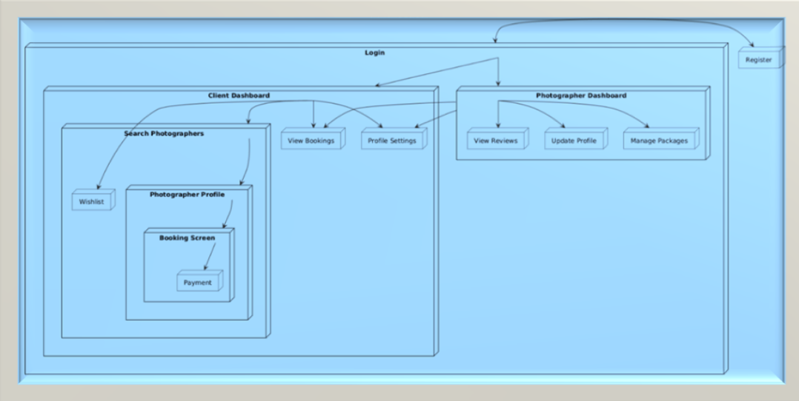

# photomate
p/s: since we don't know how to integrated together all the codes and causes lots of errors. We decided to create new repo to finalized all the codes to ensure there's no error to connect with database.

# PhotoMates IIUM
 Group name: Educ8

 The photographers recruiting app aims to bridge this gap by providing a dedicated platform to connect photographers and clients within IIUM. It offers a space where photographers can showcase their portfolios, highlight their expertise, and receive bookings, while clients can effortlessly browse and hire photographers based on their specific needs. By fostering a network of creativity and professionalism, this app seeks to enhance the campus experience, empower photographers, and simplify event planning for all stakeholders

# Group member: 
1.Mohamad Nasurudeen Bin Shaik Abdullah (2124091)
2.MUHAMMAD KHAIRUL IKHWAN BIN MOHD IQBAL (2110753)
3.Md.Fahim Bhuiyan (1821281)

# DEVELOPMENT PLAN

Phase 1: Project Initiation (23 Dec – 24 Dec 2024)
Phase 2: Requirement Analysis (25 Dec – 28 Dec 2024)
Phase 3: Prototyping (29 Dec 2024 – 4 Jan 2025)
Phase 4: Design (5 Jan – 14 Jan 2025)
Phase 5: Development (15 Jan – 24 Jan 2025)
Phase 6: Presentation and Final Review (30 Jan 2025)

# TASK DISTRIBUTION
1.Mohamad Nasurudeen Bin Shaik Abdullah (2124091)
a. Case Study 1
-Project Initiation

2.MUHAMMAD KHAIRUL IKHWAN BIN MOHD IQBAL (2110753)
a. Case Study 1
-Ghantt Chart and Timeline

3.Md.Fahim Bhuiyan (1821281)
a. Case Study 1
-Requirement  Analysis

# Project Initiation

# Title : PhotoMates IIUM.

PhotoMates IIUM is a recruiting app aims to bridge this gap by providing a dedicated platform to connect photographers and clients within IIUM. It offers a space where photographers can showcase their portfolios, highlight their expertise, and receive bookings, while clients can effortlessly browse and hire photographers based on their specific needs. By fostering a network of creativity and professionalism, this app seeks to enhance the campus experience, empower photographers, and simplify event planning for all stakeholders.

# Background Of The Problem

Photography is important for documenting memories, exhibiting creativity, and meeting both personal and academic demands. However, there isn't a specific platform that links photographers with people in need of their services, even though the International Islamic University Malaysia (IIUM) staff and students are becoming more and more in need of professional photographic services.

The IIUM community's talented photographers have fewer options to connect with potential clients, develop their portfolios, and display their abilities due to the lack of a centralised platform. This disparity emphasises the necessity of an approachable and user-friendly solution to close the gap between photographers and people looking to hire them.

In order to solve this issue and promote an established creative ecosystem inside the university, the suggested mobile application, PhotoMates IIUM, seeks to develop a smooth and effective platform that benefits both users and photographers.

# Objective

The objectives of PhotoMates IIUM include:

Facilitating Connections
Establish a centralised platform within the IIUM community that serves as a conduit between clients and photographers.

Promoting Local Talent
To give photographers from IIUM a place to display their work, get noticed, and expand their professional networks.

Streamlining the Process
Make it easier for users to find, evaluate, and reserve photographers based on their choices, including availability, price, and style.

Encouraging Creativity
Encourage photography as an art form and a career in order to cultivate a creative ecology within IIUM.

Enhancing Convenience
To offer a user-friendly and reliable platform that saves time and effort for both photographers and clients.

# Target User

Our primary target users of PhotoMates IIUM are:

IIUM Students
IIUM Staff
IIUM Photographers
Event Organizers in IIUM

# Preferred Platform

For the initial development phase, PhotoMates IIUM will be developed on the Android platform. It may be possible to expand the app to other platforms, like iOS when resources become available and the app gets popularity.

# Features And Functionalities

The following key features are incorporated to ensure user satisfaction and ease of use:

Select Photographers
To make sure they discover the ideal photographer for their requirements, users can explore IIUM and select the photographers they want based on their tastes.

View Portfolio
Users can view the selected photographer’s portfolio to evaluate their work quality and style before making a booking decision.

Select Package
Based on the chosen photographer, users can explore and select from various photography packages tailored to different needs and budgets.

Booking Date
Users can check the photographer’s availability through an integrated calendar and book a date that suits their schedule.

Confirmation
After finalizing the booking details, users will receive a confirmation of their selected date and package, ensuring clarity and commitment.

Profile Customization
Photographers can create detailed profiles showcasing their skills, contact information, past client reviews, and availability, making it easier for clients to make informed decisions.

Search & Filter
The app allows users to search for photographers based on their expertise and apply filters such as price range, ratings, or availability for a more refined search experience.

Wishlist
Users can save their favorite photographers to a wishlist for future reference and bookings, making it convenient to revisit preferred options.

Review & Ratings System
Clients can rate photographers and leave feedback based on their experiences. This feature enhances transparency, builds trust, and helps photographers improve their services.

# Requirement  Analysis

# Back-End Assessments

Data Storage:
Store structured data, including user profiles, portfolios, packages, and booking information, in a relational database called MySQL.
Consider using Firebase Storage, a cloud-based storage solution, to house photographers' portfolio photos.

# CRUD Operations

Enable Create, Read, Update, Delete functionalities for:
Photographer profiles.
Client profiles.
Packages offered by photographers.
Booking and review records.

# Plugins and Integrations

Use plugins or APIs for:

Payment Gateway Integration (e.g., Stripe/PayPal/GPay).
Calendar API to manage booking availability.
Social Media Sharing for photographers to share profiles.

# Platform Compatibility

Target Platforms:

Smartphones. Build a cross-platform mobile app using Flutter to ensure compatibility with Android.

# Responsive Design:

Implement adaptive UI layouts for various screen sizes using frameworks like Flutter

# Performance Optimization:

Optimize loading times for portfolio images using lazy loading techniques.

# Logical Design
 Sequence Diagram:
Illustrate the interaction flow between users (clients and photographers), the app, and the database/backend.

# Screen Navigation Flow:

Home Screen:
Search bar, featured photographers, and navigation options.

Photographer Profile:
Portfolio, packages, availability calendar, and contact info.

# Booking Flow:

1.	Select package.
2.	Choose available date.
3.	Confirm booking.
4.	Payment screen.

# User Dashboard:

Upcoming bookings, past bookings, and wishlist.

Admin Panel (optional):

Manage photographers, clients, and reviews.

# Ghantt Chart and Timeline

Here is the timeline for the tasks associated with the project:

# A) Case Study 1

Project Initiation

Start Date: 27 November 2024
End Date: 5 December 2024
Duration: 8 days

Requirement Analysis

Start Date: 6 December 2024
End Date: 20 December 2024
Duration: 14 days

# B) Case Study 2

Prototyping

Start Date: 29 December 2024
End Date: 4 January 2025
Duration: 7 days

Design

Start Date: 5 January 2025
End Date: 14 January 2025
Duration: 10 days

# C) Group Project

Development

Start Date: 15 January 2025
End Date: 24 January 2025
Duration: 10 days

Presentation

Deadline: 30 January 2025
Preparation Period: 25 January 2025 – 29 January 2025 

# References

1. Google. (2023, April 5). Firebase documentation. https://firebase.google.com/docs
2. Stack Overflow (2024). Flutter questions. https://stackoverflow.com/questions/tagged/flutter
3. OpenAI. (2024). OpenAI API documentation. https://platform.openai.com/docs
4. SimplyBook (2024). Features & Integrations. https://simplybook.me/en/booking-system-features-and-integrations
5. OpenAI (2024). Features that can be improved. https://chatgpt.com
6. V. Pham (2024). Guide to Mobile Application Development. https://kms-solutions.asia/blogs/an-ultimate-guide-to-mobile-application-development

